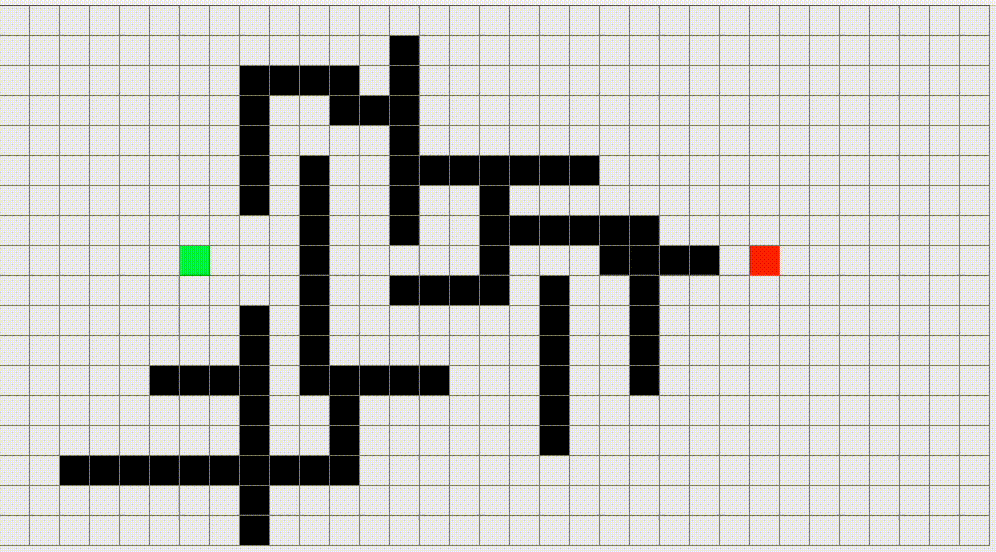

# Pathfinding Visualizer
A Java program developed to visualize A* pathfinding algorithm in real-time. I implemented the A* algorithm in Java to find the shortest distance between two points on a square grid and utilized Swing toolkit to show the algorithm searching possible paths in real-time.

